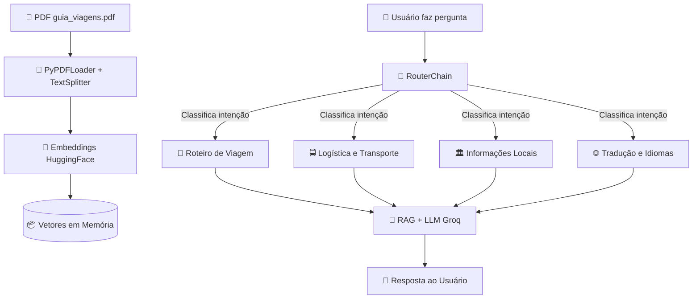

# 📖 Guia de Viagem Inteligente com RAG e Roteamento de Cadeias

Este projeto foi desenvolvido como parte da disciplina de **Inteligência Artificial** do **Mestrado Profissional em Sistemas Aplicados à Engenharia e Gestão (SAEG)** do **Instituto Federal Fluminense (IFF)**.  

O objetivo é demonstrar o uso de técnicas modernas de **Geração Aumentada por Recuperação (RAG)** e **roteamento de cadeias (Chain Routing)** para construir um **assistente inteligente de viagens**, capaz de responder perguntas, sugerir roteiros e fornecer informações locais a partir de um guia em PDF.

---

## 🚀 Estrutura do Projeto

O trabalho possui **duas formas de execução**:

1. **Notebook Jupyter**  
   - Arquivo: `Guia de Viagem Inteligente com RAG e Roteamento de Cadeias.ipynb`  
   - Contém toda a lógica de construção da pipeline, com explicações passo a passo.  
   - Útil para estudo, experimentação e reprodutibilidade acadêmica.  

2. **Aplicativo em Streamlit**  
   - Arquivo: `app.py`  
   - Reproduz as funcionalidades do notebook em uma **interface de chat interativa**.  
   - Permite ao usuário conversar com o assistente e obter respostas personalizadas.  

---

## 🧠 Tecnologias Utilizadas

- **Python 3.10+**
- **Jupyter Notebook** – para experimentação e estudo interativo.
- **Streamlit** – criação da interface de chat para o usuário.
- **LangChain** – construção das pipelines de RAG e roteamento de cadeias.
- **Groq + LLaMA 3.3-70B** – modelo de linguagem utilizado para respostas em português.
- **HuggingFace Transformers** – embeddings semânticos (`sentence-transformers/all-MiniLM-L6-v2`).
- **NumPy e SciPy** – cálculos matemáticos e operações vetoriais.
- **PyPDFLoader** – carregamento e divisão do PDF turístico.
- **dotenv** – gerenciamento de variáveis de ambiente.
- **requirements.txt** – lista completa de dependências do projeto.

---

## ⚙️ Instalação

1. Clone o repositório ou copie os arquivos para sua máquina.  
2. Crie um ambiente virtual e ative-o:
   ```bash
   python -m venv .venv
   source .venv/bin/activate   # Linux/Mac
   .venv\Scripts\activate      # Windows
   ```
3. Instale as dependências:
   ```bash
   pip install -r requirements.txt
   ```
4. Configure a chave da API da **Groq**:
   - Crie um arquivo `.env` na raiz do projeto.
   - Adicione a variável:
     ```
     GROQ_API_KEY=sua_chave_aqui
     ```
5. Coloque o arquivo **`guia_viagens.pdf`** dentro da pasta `guia/`.

---

## ▶️ Execução

### 1. Usando o Notebook
Abra o arquivo no Jupyter:
```bash
jupyter notebook "Guia de Viagem Inteligente com RAG e Roteamento de Cadeias.ipynb"
```
Siga as células sequencialmente para entender e rodar os experimentos.

### 2. Usando o App Streamlit
Execute o comando:
```bash
streamlit run app.py
```
Uma interface será aberta no navegador, permitindo interagir com o **assistente de viagens**.

---

## 🛠️ Funcionalidades do Assistente

O sistema utiliza **roteamento automático de intenções** para escolher a melhor cadeia de resposta:

- 📅 **Roteiro de Viagem** → Criação de itinerários organizados por dias e perfil do viajante.  
- 🚍 **Logística e Transporte** → Informações sobre deslocamentos, hospedagem e custos.  
- 🏛️ **Informações Locais** → Atrações, restaurantes, horários e dicas práticas.  
- 🌐 **Tradução e Idiomas** → Frases úteis traduzidas para o idioma do destino.  

---

## 📊 Fluxo do Sistema



---

## 🎯 Conclusão

Este trabalho integra conceitos avançados de **IA aplicada a sistemas reais**, unindo **recuperação de informações**, **modelos de linguagem de última geração** e **interfaces amigáveis**.  

Ele serve tanto como **ferramenta prática de apoio a viajantes** quanto como **demonstração acadêmica** de como técnicas de **RAG + roteamento** podem ser aplicadas em cenários do mundo real.  
